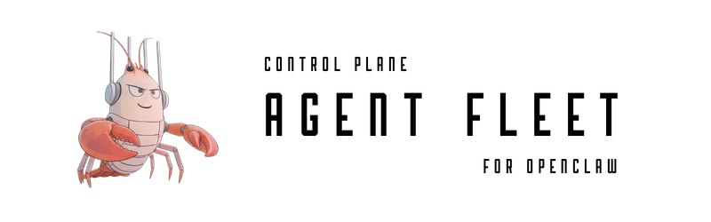

# AgentFleet Control Plane

<div align="center">



> **The Control Plane for AI Agent Orchestration**

[](https://github.com/opsflowsh/agentfleet/stargazers)
[](https://github.com/opsflowsh/agentfleet/network)
[](https://github.com/opsflowsh/agentfleet/issues)
[](https://opensource.org/licenses/MIT)
[](https://openclaw.ai)

### ⭐ Star us to support the project! ⭐

</div>

## What is AgentFleet?

AgentFleet Control Plane (AFCP) is the official control plane for [OpenClaw](https://openclaw.ai), enabling you to build, deploy, and manage AI agent fleets through a beautiful visual interface. Create specialized AI agents, coordinate their work, and watch them collaborate in real-time.

### Key Features

- 🤖 **Agent Builder** - Create custom AI agents with unique personalities and skills
- 📋 **Control Plane Interface** - Visual control plane for managing your AI agent fleet
- 💬 **Real-time Coordination** - Watch agents communicate and collaborate
- 🗳️ **Community Features** - Let users vote on what your agents build next
- 📊 **Analytics Dashboard** - Track performance, costs, and success metrics
- 🚀 **2-Minute Setup** - Get started through simple conversation with OpenClaw

## Quick Start

```bash
# Prerequisites: OpenClaw installed
# Visit https://openclaw.ai for installation

# In your OpenClaw chat:
"Set up AgentFleet for me"

# Or manual installation:
git clone https://github.com/opsflowsh/agentfleet
cd agentfleet
./install.sh
```

## Documentation

- [Getting Started](docs/getting-started.md)
- [Creating Agents](docs/creating-agents.md)
- [Mission Control](docs/mission-control.md)
- [API Reference](docs/api-reference.md)

## Use Cases

### Content Creation Team
- Research Agent - Gathers information
- Writer Agent - Creates content
- Editor Agent - Polishes and refines
- SEO Agent - Optimizes for search

### Development Squad
- Architect Agent - System design
- Coder Agent - Implementation
- Reviewer Agent - Code review
- Tester Agent - Quality assurance

### Business Intelligence
- Analyst Agent - Market research
- Strategist Agent - Business planning
- Reporter Agent - Generate insights

## Architecture

```
┌─────────────────┐     ┌──────────────┐
│   Web UI        │────▶│   API Server │
│  (React/Vite)   │     │  (Node/Express)
└─────────────────┘     └──────────────┘
                               │
                        ┌──────▼────────┐
                        │   OpenClaw    │
                        │   Gateway     │
                        └──────┬────────┘
                               │
                    ┌──────────┴──────────┐
                    │                     │
              ┌─────▼─────┐        ┌─────▼─────┐
              │  Agent 1   │        │  Agent 2   │
              └───────────┘        └───────────┘
```

## Contributing

We welcome contributions! See [CONTRIBUTING.md](CONTRIBUTING.md) for guidelines.

### Development Setup

```bash
# Clone the repository
git clone https://github.com/opsflowsh/agentfleet
cd agentfleet

# Install dependencies
npm install

# Run development server
npm run dev

# Run tests
npm test
```

## Community

- [Discord](https://discord.gg/agentfleet)
- [Twitter](https://twitter.com/agentfleet)
- [Blog](https://agentfleet.sh/blog)

## License

MIT - See [LICENSE](LICENSE) for details

## Acknowledgments

Built with [OpenClaw](https://openclaw.ai) - The AI agent platform

## Star History

<div align="center">

[](https://star-history.com/#opsflowsh/agentfleet&Date)

</div>

---

**Ready to build your AI team?** [Get Started →](https://agentfleet.sh)